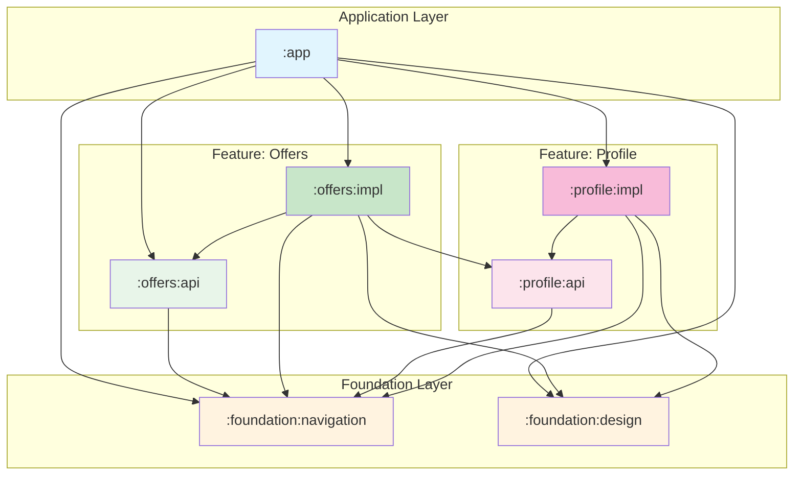

# Navigation 3 Multi-Module Sample

A sample Android project demonstrating **Jetpack Navigation 3** with **Hilt Dependency Injection** in a multi-module architecture. This project showcases best practices for modular navigation where feature modules remain isolated and only have access to the dependencies they truly need.

## 🛠 Tech Stack

- **Jetpack Navigation 3** - Type-safe navigation with `NavKey`
- **Hilt** - Dependency injection with multibinding support
- **Jetpack Compose** - Modern declarative UI
- **Multi-Module Architecture** - Clean separation with api/impl pattern

## 📦 Module Structure

```
Nav3Sample/
├── app/                          # Application module (entry point)
├── foundation/
│   ├── design/                   # Shared design system (Theme, Colors, Typography)
│   └── navigation/               # Core navigation utilities (Navigator, EntryProviderInstaller)
├── offers/
│   ├── api/                      # Public navigation contracts (NavKeys)
│   └── impl/                     # Feature implementation (UI, ViewModels, DI)
└── profile/
    ├── api/                      # Public navigation contracts (NavKeys)
    └── impl/                     # Feature implementation (UI, ViewModels, DI)
```

### Module Dependency Diagram



> **Key Insight**: Notice how `:offers:impl` only depends on `:profile:api` (not `:profile:impl`). This ensures feature modules can navigate to each other without accessing implementation details.

---

## 📚 Use Cases

### 1. Multi-Module Navigation with Hilt Multibinding

This use case demonstrates the **ideal multi-module navigation pattern** where:
- Feature modules are isolated and only depend on what they need
- Navigation destinations are registered via Hilt's multibinding
- Modules expose only `NavKey` contracts through their API modules

#### Architecture Overview

```
┌─────────────────────────────────────────────────────────────────────────┐
│                              MainActivity                               │
│  ┌───────────────────────────────────────────────────────────────────┐  │
│  │                           NavDisplay                              │  │
│  │                               │                                   │  │
│  │                    ┌──────────┴──────────┐                        │  │
│  │                    ▼                     ▼                        │  │
│  │         Set<EntryProviderInstaller>      Navigator                │  │
│  │         (collected via multibinding)     (backstack management)   │  │
│  └───────────────────────────────────────────────────────────────────┘  │
└─────────────────────────────────────────────────────────────────────────┘
                                    │
                    ┌───────────────┼───────────────┐
                    ▼               ▼               ▼
            ┌──────────────┐ ┌──────────────┐ ┌──────────────┐
            │ OffersModule │ │ ProfileModule│ │  MainModule  │
            │   @IntoSet   │ │   @IntoSet   │ │   @IntoSet   │
            │  installer   │ │   installer  │ │   installer  │
            └──────────────┘ └──────────────┘ └──────────────┘
```

#### Key Components

**1. Navigator Class** (`foundation:navigation`)

The `Navigator` is the central backstack manager, scoped to `ActivityRetainedComponent`:

```kotlin
@ActivityRetainedScoped
class Navigator(startDestination: NavKey) {
    val backStack: SnapshotStateList<NavKey> = mutableStateListOf(startDestination)

    fun goTo(destination: NavKey) {
        backStack.add(destination)
    }

    fun goBack() {
        backStack.removeLastOrNull()
    }
}
```

**2. EntryProviderInstaller** (`foundation:navigation`)

A typealias that allows feature modules to register their navigation entries:

```kotlin
typealias EntryProviderInstaller = EntryProviderScope<NavKey>.() -> Unit
```

**3. Navigation Module with Multibinding** (`foundation:navigation`)

Declares an empty set that feature modules contribute to:

```kotlin
@Module
@InstallIn(ActivityRetainedComponent::class)
abstract class NavigationModule {
    @Multibinds
    abstract fun bindEntryProviderInstallers(): Set<EntryProviderInstaller>
}
```

**4. Feature Module Registration** (`offers:impl`)

Each feature module provides its entry installers using `@IntoSet`:

```kotlin
@Module
@InstallIn(ActivityRetainedComponent::class)
object OffersModule {

    @IntoSet
    @Provides
    fun provideOffersEntryProviderInstaller(navigator: Navigator): EntryProviderInstaller = {
        entry<OffersNavigation.Offers> {
            OffersUi(
                onOfferClick = { navigator.goTo(OffersNavigation.OfferDetails(it)) }
            )
        }
    }
}
```

**5. NavKey Definitions** (`offers:api`)

API modules expose only the navigation contracts:

```kotlin
object OffersNavigation {
    object Offers : NavKey
    data class OfferDetails(val id: Int) : NavKey
}
```

**6. Consuming in MainActivity** (`app`)

All installers are collected and applied to the `NavDisplay`:

```kotlin
@Inject
lateinit var entryProviderScopes: Set<@JvmSuppressWildcards EntryProviderInstaller>

NavDisplay(
    backStack = navigator.backStack,
    onBack = { navigator.goBack() },
    entryProvider = entryProvider {
        entryProviderScopes.forEach { builder -> builder() }
    },
)
```

#### Benefits of This Approach

| Benefit | Description |
|---------|-------------|
| **Module Isolation** | Feature implementations don't know about each other |
| **Minimal API Surface** | Only `NavKey` objects are exposed publicly |
| **Compile-Time Safety** | Type-safe navigation with `NavKey` classes |
| **Easy Feature Addition** | New features just add `@IntoSet` providers |
| **Testability** | Each module can be tested independently |

---

### 2. 🚧 Under Construction

> **Coming Soon**: Additional navigation patterns and use cases will be documented here.

*Planned topics may include:*
- Bottom sheet navigation
- Nested navigation graphs
- Deep linking
- Shared element transitions

---

## 🚀 Getting Started

### Prerequisites

- Android Studio Ladybug or newer
- JDK 11+
- Android SDK 36

### Build & Run

```bash
# Clone the repository
git clone <repository-url>

# Build the project
./gradlew assembleDebug

# Run on connected device/emulator
./gradlew installDebug
```

---

## 📁 Key Files Reference

| File | Description |
|------|-------------|
| `foundation/navigation/NavigationUtil.kt` | `Navigator` class and `EntryProviderInstaller` typealias |
| `foundation/navigation/NavigationModule.kt` | Hilt module with `@Multibinds` declaration |
| `offers/api/OffersNavigation.kt` | Public `NavKey` definitions for offers feature |
| `offers/impl/OffersModule.kt` | Hilt module registering offers entry providers |
| `app/MainActivity.kt` | Entry point that assembles all navigation entries |

---

## 📄 License

```
Copyright 2025

Licensed under the Apache License, Version 2.0
```

